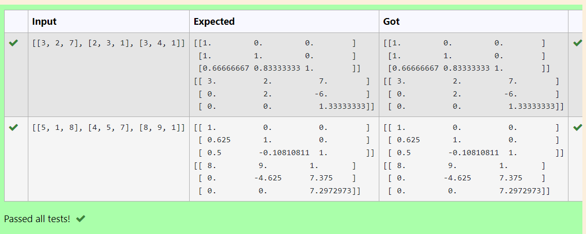
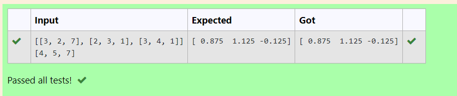

# LU Decomposition 

## AIM:
To write a program to find the LU Decomposition of a matrix.

## Equipments Required:
1. Hardware – PCs
2. Anaconda – Python 3.7 Installation / Moodle-Code Runner

## Algorithm
1. Import numpy as np
2. From Scipy package import lu
3. Get input from the user
4. Print result

## Program:
```
Program to find L and U matrix using LU decomposition.
Developed by: G Dario
RegisterNumber:22008843

import numpy as np
from scipy.linalg import lu
A= np.array(eval(input()))
P,L,U=lu(A)
print(L)
print(U)
```
```
Program to solve a matrix using LU decomposition.
Developed by: G Dario
RegisterNumber:22008843

import numpy as np
from scipy.linalg import lu_factor,lu_solve
A= np.array(eval(input()))
b= np.array(eval(input()))
lu,piv=lu_factor(A)
x=lu_solve((lu,piv),b)
print(x)
 
```

## Output:
### 1st Problem

### 2nd Problem


## Result:
Thus the program to find the LU Decomposition of a matrix is written and verified using python programming.

